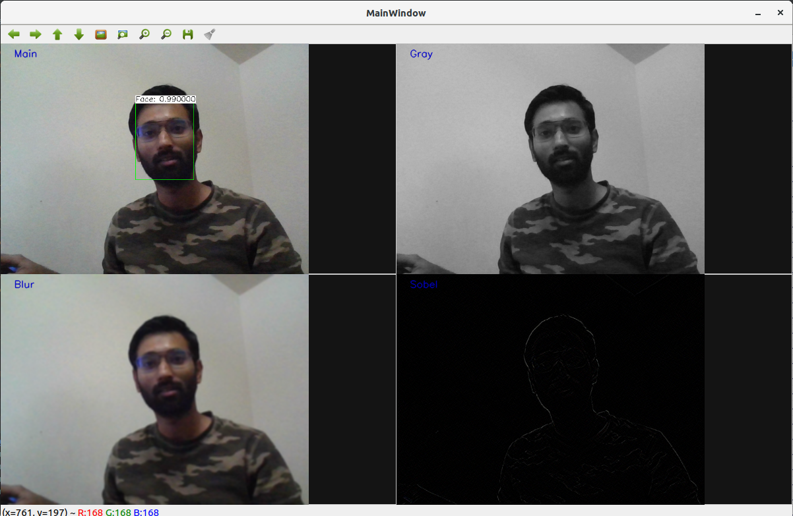

# Simple Multithreaded WebCam Processor

Generates 2x2 window of processed web cam feed with various filters and face detector. Needs a working web cam

## Overview

This is Basic Image processing and face detection project with C++ and OpenCV. This application uses web camera 
to detect faces and apply various filters in the filter window at runtime. The output has concurrent windows for output 
driven by 4 concurrent threads producing the 4 processed live stream. Every alternate frame is processed enabling it to 
work on raspberry pi as well.

---------

Project Architecture:
1. class:  MultWindow .h/.cpp => Class build to generate multiple window output, displaying several frame. Based on OpenCV 
display libs
2. class: NNProcessor .h/.cpp => Class build to create pre trained neural network. Uses config and weight path to read data, 
these files are included in data folder of the project. It has has methods to process and overlay information with prediction
on every frame of the video stream.
3. Driver: main.cpp => This is the main driver of the module. It has helper methods for blurring grayscale and sobel filters.
It also starts the projects, create the video stream from web cam and processes each frame concurrently with 4 different 
image processors. 

<BR></BR><BR></BR><BR></BR>
## Dependencies
- CMake (>= 3.12): For project building
- OpenCV (>= 4.1): Project dependency
- C++17
- Webcam!!!


### Notice 
This requires OpenCV library.
For more installation instructions, please visit
https://docs.opencv.org/master/d7/d9f/tutorial_linux_install.html

### Build and run
This project contains cmake that allows you to make easy. 

```
mkdir build
cd build
cmake ..
make
./ImageProc
```

## Rubrics

<table class="tg">
  <tr>
    <th class="tg-0pky">A README with instructions is included with the project</th>
    <th class="tg-0pky">ReadME.md Added</th>
  </tr>
  <tr>
    <td class="tg-0pky">The README indicates which project is chosen.</td>
    <td class="tg-0pky">Project architecture explain each class and their usage.</td>
  </tr>
  <tr>
    <td class="tg-0pky">The README includes information about each rubric point addressed.</td>
    <td class="tg-0pky">Yes</td>
  </tr>
  <tr>
    <td class="tg-0pky">The submission must compile and run.</td>
    <td class="tg-0pky">Yes</td>
  </tr>
  <tr>
    <td class="tg-0pky">The project demonstrates an understanding of C++ functions and control structures.</td>
    <td class="tg-0pky">C++ functions and control structures specifications are followed</td>
  </tr>
  <tr>
    <td class="tg-0pky">The project reads data from a file and process the data, or the program writes data to a file.</td>
    <td class="tg-0pky">Project reads model config and model weight from external files</td>
  </tr>
  <tr>
    <td class="tg-0pky">The project accepts user input and processes the input.</td>
    <td class="tg-0pky">Project works on webcam feed to run, which is also the user input.</td>
  </tr>
  <tr>
    <td class="tg-0pky">The project uses Object Oriented Programming techniques.</td>
    <td class="tg-0pky">Project is designed in object oriented manner</td>
  </tr>
  <tr>
    <td class="tg-0pky">Classes use appropriate access specifiers for class members.</td>
    <td class="tg-0pky">data members are explicitly marked as public or private.</td>
  </tr>
  <tr>
    <td class="tg-0pky">Class constructors utilize member initialization lists.</td>
    <td class="tg-0pky">Member initialization lists are used to initialize when applicable</td>
  </tr>
  <tr>
    <td class="tg-0pky">Classes abstract implementation details from their interfaces.</td>
    <td class="tg-0pky">Not Required</td>
  </tr>
  <tr>
    <td class="tg-0pky">Classes encapsulate behavior.</td>
    <td class="tg-0pky">Not Required</td>
  </tr>
  <tr>
    <td class="tg-0pky">Classes follow an appropriate inheritance hierarchy.</td>
    <td class="tg-0pky">Not Required</td>
  </tr>
  <tr>
    <td class="tg-0pky">Overloaded functions allow the same function to operate on different parameters.</td>
    <td class="tg-0pky">Not Required</td>
  </tr>
  <tr>
    <td class="tg-0pky">Derived class functions override virtual base class functions.</td>
    <td class="tg-0pky">Not Required</td>
  </tr>
  <tr>
    <td class="tg-0pky">Templates generalize functions in the project.</td>
    <td class="tg-0pky">Not Required</td>
  </tr>
  <tr>
    <td class="tg-0pky">The project makes use of references in function declarations.</td>
    <td class="tg-0pky">Almost all functions accept inputs as reference for large data</td>
  </tr>
  <tr>
    <td class="tg-0pky">The project uses destructors appropriately.</td>
    <td class="tg-0pky">The destructor is implemented.</td>
  </tr>
  <tr>
    <td class="tg-0pky">The project uses scope / Resource Acquisition Is Initialization (RAII) where appropriate.</td>
    <td class="tg-0pky">Principle of RAII is followed</td>
  </tr>
  <tr>
    <td class="tg-0pky">The project follows the Rule of 5.</td>
    <td class="tg-0pky">Not Required</td>
  </tr>
  <tr>
    <td class="tg-0pky">The project uses move semantics to move data, instead of copying it, where possible.</td>
    <td class="tg-0pky">Not Required</td>
  </tr>
  <tr>
    <td class="tg-0pky">The project uses smart pointers instead of raw pointers.</td>
    <td class="tg-0pky">There are no naked pointers. Smart pointers are used to allocate memory on freestore.</td>
  </tr>
  <tr>
    <td class="tg-0pky">The project uses multithreading.</td>
    <td class="tg-0pky">The project uses multiple threads in the execution.</td>
  </tr>
  <tr>
    <td class="tg-0pky">A promise and future is used in the project.</td>
    <td class="tg-0pky">Not Required</td>
  </tr>
  <tr>
    <td class="tg-0pky">A mutex or lock is used in the project.</td>
    <td class="tg-0pky">Not Required as threads const access data</td>
  </tr>
  <tr>
    <td class="tg-0pky">A condition variable is used in the project.</td>
    <td class="tg-0pky">Not Required</td>
  </tr>
</table>