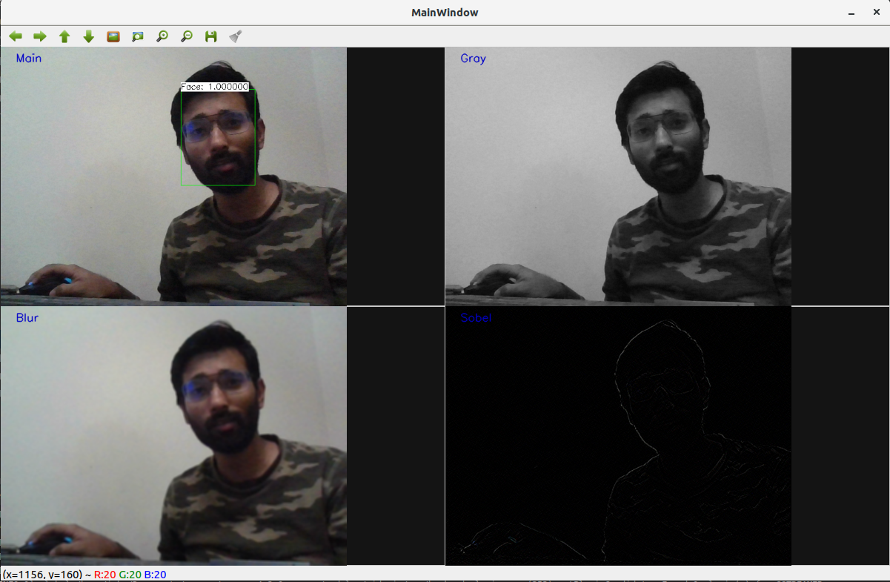

# Simple Multithreaded WebCam face detector

Generates 2x2 window of processed web cam feed with various filters and face detector. Needs a working web cam

## Overview

This is Basic Image processing and face detection project with C++ and OpenCV. This application uses web camera 
to detect faces and apply various filters runtime. The output has 4 windows for video streams 
driven by 4 concurrent threads producing the processed live stream. Every alternate frame is processed enabling it to 
work on raspberry pi as well.

---------

Project Architecture:
1. class:  MultWindow .h/.cpp => Class build to generate multiple window output, displaying several frame. Based on OpenCV 
display libs
2. class: NNProcessor .h/.cpp => Class build to create pre trained neural network. Uses config and weight path to read data, 
these files are included in data folder of the project. It has has methods to process and overlay information with prediction
on every frame of the video stream.
3. Driver: main.cpp => This is the main driver of the module. It has helper methods for blurring grayscale and sobel filters.
It also starts the projects, create the video stream from web cam and processes each frame concurrently with 4 different 
image processors. 

<BR></BR><BR></BR><BR></BR>
## Dependencies
- CMake (>= 3.12): For project building
- OpenCV (>= 4.1): Project dependency
- C++17
- Webcam!!!


### Notice 
This requires OpenCV library.
For more installation instructions, please visit
https://docs.opencv.org/master/d7/d9f/tutorial_linux_install.html

### Build and run
This project contains cmake that allows you to make easy. 

```
mkdir build
cd build
cmake ..
make
./ImageProc
```

